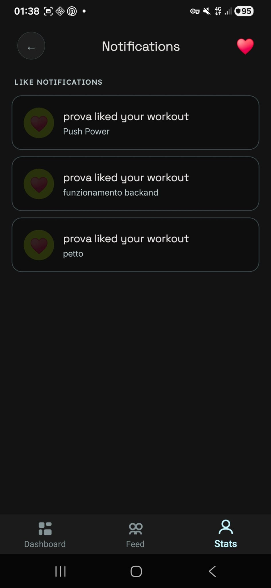

# FORGE — Il tuo diario di allenamento sociale

<div align="center">

**Trasforma ogni ripetizione in progresso. Sfida i tuoi amici. Supera i tuoi limiti.**

[](https://learn.microsoft.com/dotnet/maui/)
[](https://pocketbase.io/)
[](https://rapidapi.com/justin-WFnsXH_t6/api/exercisedb)
[](https://learn.microsoft.com/dotnet/communitytoolkit/mvvm/)

[Panoramica](#panoramica) ·
[Perché FORGE](#perché-forge) ·
[Come funziona](#come-funziona) ·
[Architettura](#architettura) ·
[Download APK](#download-apk) ·
[Installazione e Build](#installazione-e-build) ·
[Documentazione](#documentazione)

</div>

---

## Panoramica

**FORGE** è un'app `.NET MAUI` Android-first per chi si allena in palestra e vuole:

- 🏋️ Esplorare un catalogo di **1300+ esercizi** con immagini e istruzioni, filtrati per gruppo muscolare e attrezzatura
- 📊 Registrare allenamenti completi con serie, ripetizioni e peso in pochi secondi
- 🔥 Competere con gli amici tramite **feed allenamenti**, **like** e **streak settimanali**
- 📈 Visualizzare statistiche di progresso con grafici e top lifts
- 🎨 Godersi un'interfaccia curata con tema chiaro/scuro e font Google Fonts (Inter, Lexend, Space Grotesk)

L'app usa **ExerciseDB API** (RapidAPI) per il catalogo esercizi e **PocketBase** self-hosted per autenticazione, dati social e persistenza remota.

---

## Perché FORGE

Andare in palestra senza tracciare i progressi è come guidare senza cruscotto: vai avanti, ma non sai se stai migliorando. Allenarsi da soli, poi, riduce la motivazione.

FORGE risolve tre problemi reali:

| Problema | Soluzione |
|----------|-----------|
| Non ricordo i pesi della volta scorsa | Storico allenamenti con dettaglio serie per serie salvato su PocketBase |
| Non so quali esercizi fare per un muscolo | Catalogo 1300+ esercizi con immagini, ricerca e filtri |
| Mi alleno da solo e perdo motivazione | Feed amici, like sugli allenamenti, streak settimanale |

---

## Come funziona

### 🚀 Primo avvio
1. L'utente apre l'app e vede la schermata di **Login** (sopra)
2. Può registrarsi con email, nome e password (account creato su PocketBase)
3. Le credenziali vengono salvate in locale per l'auto-login
4. Dopo il login, atterra sulla **Dashboard**

<p align="center"></p>

### 📋 Dashboard (Tab 1)

<p align="center"></p>

- **Squad Activity**: avatar circolari degli amici seguiti con allenamenti recenti — tap per andare al Feed
- **Current Streak**: numero di settimane consecutive con almeno un allenamento (reset dopo 7+ giorni di inattività)
- **Today Card**: piano di allenamento casuale dalla tua libreria — tap per avviarlo subito
- **▶ START WORKOUT**: pulsante principale che apre la schermata Start Session

### 🔍 Feed & Social (Tab 2)

<p align="center"></p>

- **Search Bar**: cerca altri atleti per nome (live search con debounce 400ms)
- **Follow/Unfollow**: invia richieste di amicizia con un tap
- **Feed Allenamenti**: scroll verticale dei workout degli amici con:
  - Nome atleta, avatar, tempo trascorso
  - Nome allenamento, lista esercizi, volume totale, durata
  - **Like (♥)**: tap per mettere/togliere like — il cuore si riempie in LimeGreen e il conteggio si aggiorna istantaneamente
- **Avatar in alto a sinistra**: tap per aprire il tuo Profilo
- **⚙ in alto a destra**: Impostazioni (tema chiaro/scuro, logout)

### 📊 Statistiche (Tab 3)

<p align="center"></p>

- **TopBar**: avatar profilo (tap → Profilo), titolo FORGE, ♥ (tap → Notifiche)
- **Total Workouts / Volume / Hours**: card riepilogative con trend
- **Filtri temporali**: WEEK / MONTH / 3M / YEAR / ALL — cliccabili con feedback visivo
- **Grafico volume**: barre settimanali con etichette data e divisori mese
- **Top Lifts**: i 5 esercizi con peso massimo sollevato
- **Calendario**: vista mensile con pallino Primary sui giorni di allenamento, LimeGreen su oggi

### 🔔 Notifiche (da ♥ in Stats)
- **Friend Requests**: richieste di amicizia in sospeso con pulsanti ACCEPT / REJECT
- **Like Notifications**: quando un utente mette like a un tuo allenamento, vedi: `{Nome} liked your workout {NomeWorkout}`

<p align="center"></p>

### 🏋️ Start Session
- **Quick Start**: avvia un allenamento libero (modalità free)
- **Create New Plan**: vai alla creazione guidata di un piano
- **Your Protocols**: lista dei piani salvati con esercizi, serie, peso, ripetizioni, tempo di recupero — tap per avviare, ✕ per eliminare

### 💪 Allenamento Attivo

<p align="center"></p>

- **Progress Bar**: barra Primary in cima, percentuale completamento
- **Header**: ✕ chiudi, nome scheda (SpaceGrotesk), pulsante FINISH
- **Ricerca esercizi**: barra ricerca con chip per gruppo muscolare e attrezzatura — fetch da ExerciseDB API con cache su PocketBase
- **Card esercizio**: immagine, nome, bodyPart, suggerimenti, note editabili
- **Tabella set**: righe con SET / KG / REPS / ✓ — Entry numeriche, tap sul cerchio per completare (si riempie LimeGreen)
- **Add Set**: bottone per aggiungere una serie
- **Rest Timer**: input secondi pausa globale, timer per esercizio
- **Finish**: salva l'allenamento su PocketBase con nome, data, volume, durata, esercizi

<p align="center"></p>

### 👤 Profilo

<p align="center"></p>

- **Avatar**: foto profilo da PocketBase (o iniziali se non caricata) — tappabile per cambiare foto
- **Statistiche**: Total Workouts, Total Volume, Week Streak, ♥ Likes ricevuti
- **Recent Forges**: lista ultimi allenamenti con titolo, data, durata, like, volume
- **Edit Profile** (✏️): modifica nome e bio, anteprima avatar, salva

### ⚙️ Impostazioni
- **Dark Mode / Light Mode**: toggle per cambiare tema in tempo reale su tutte le pagine
- **Logout**: torna alla schermata di login

---

## Architettura

```
┌──────────────────────────────────────────────────┐
│                  .NET MAUI App                    │
│  ┌──────────┐  ┌───────────┐  ┌──────────┐      │
│  │  Views   │  │ ViewModels│  │ Services │      │
│  │  XAML    │◄─┤ MVVM      │◄─┤ Business │      │
│  │  puro    │  │ Toolkit   │  │ Logic    │      │
│  └──────────┘  └───────────┘  └────┬─────┘      │
│                                    │             │
│         ┌──────────────────────────┼──────┐      │
│         │                          │      │      │
│    ┌────▼────┐   ┌──────────┐  ┌──▼───┐ │      │
│    │ PocketBase│  │ExerciseDB│  │Plan  │ │      │
│    │ Auth +   │  │  API     │  │Store │ │      │
│    │ Social   │  │ 1300+ ex │  │Local │ │      │
│    └─────────┘  └──────────┘  └──────┘ │      │
└─────────────────────────────────────────┘      │
```

### Pattern Architetturale: MVVM

| Layer | Responsabilità | Esempio |
|-------|---------------|---------|
| **Views** (`*.xaml`) | XAML puro, binding, stili | `HomePage.xaml` |
| **ViewModels** | Stato UI, comandi, orchestrazione | `HomeViewModel.cs` |
| **Services** | Business logic, API client | `PocketBaseService.cs` |
| **Models/Dto** | Entità dominio, DTO API | `LoggedWorkoutRecord` |

### Stack Tecnologico

| Tecnologia | Ruolo |
|------------|-------|
| `.NET MAUI 10` | Framework cross-platform Android-first |
| `CommunityToolkit.Mvvm 8.4` | MVVM: `[ObservableProperty]`, `[RelayCommand]`, `WeakReferenceMessenger` |
| `Shell` | Navigazione a 3 tab + route di dettaglio |
| `PocketBase` (self-hosted) | Auth (email/password), database (allenamenti, social graph, esercizi) |
| `ExerciseDB API` (RapidAPI) | Catalogo 1300+ esercizi con immagini, istruzioni, filtri |
| `System.Text.Json` | Parsing DTO, serializzazione |
| `Preferences` | Persistenza token e credenziali |
| `PlanStore` | Salvataggio piani allenamento in JSON locale |
| Google Fonts | Inter (body), Lexend (label/caps), Space Grotesk (headline/metriche) |

### Shell Navigation

```
AppShell (TabBar)
├── Tab 1: Dashboard  →  HomePage
├── Tab 2: Feed       →  FeedPage
└── Tab 3: Stats      →  StatsPage

Route di dettaglio:
├── "profile"         →  ProfilePage
├── "settings"        →  SettingsPage
├── "startSession"    →  StartSessionPage
├── "activeWorkout"   →  ActiveWorkoutPage
├── "friendRequests"  →  FriendRequestsPage
├── "notifications"   →  NotificationsPage
└── "login"           →  LoginPage
```

### PocketBase Collections

| Collection | Campi | API Rules |
|-----------|-------|-----------|
| `users` | email, password, name, bio, avatar | Built-in PocketBase auth |
| `logged_workouts` | user, user_name, name, date, exercises, exercise_data, volume, duration, likes, liked_by | List/Search/View/Update: authenticated |
| `social_graph` | from_user, from_name, to_user, status | Create/List: authenticated |
| `excercise` | name, bodyPart, equipment, instructions, imageUrl, category, level | Create/List: authenticated |

---

## Download APK

L'APK Release già compilato è disponibile nella root del repository:

📦 **[`FORGE.apk`](FORGE.apk)** *(33.4 MB)*

> Per installarlo: scarica il file, trasferiscilo sul dispositivo Android e aprilo, oppure usa `adb install FORGE.apk`.  
> Richiede Android 7.0+ e connessione Internet per le API.

---

## Installazione e Build

### Prerequisiti
- .NET 10 SDK + MAUI workload
- Emulatore Android o dispositivo fisico (Android 7+)
- Server PocketBase attivo (configurabile via `.env`)
- Chiave API ExerciseDB da RapidAPI (configurabile via `.env`)

### Configurazione
1. Crea un file `.env` nella root del progetto:
```env
EXERCISEDB_API_KEY=la_tua_chiave_rapidapi
POCKETBASE_URL=https://tuo-server-pb.dominio.com
```

2. Il file `.env` viene copiato automaticamente in `Resources/Raw/gymtracker.env` al build e caricato a runtime.

3. Su PocketBase, assicurati che le collection `logged_workouts`, `social_graph` ed `excercise` esistano con i campi e le API Rules corrette.

### Build & Deploy
```bash
# Build
dotnet build src/GymTracker.Mobile/GymTracker.Mobile.csproj -f net10.0-android

# Publish APK Release
dotnet publish src/GymTracker.Mobile/GymTracker.Mobile.csproj -f net10.0-android -c Release /p:AndroidPackageFormats=apk

# APK generato in:
# src/GymTracker.Mobile/bin/Release/net10.0-android/publish/com.companyname.gymtracker.mobile-Signed.apk
```

---

## Documentazione

| Documento | Scopo |
|-----------|-------|
| [`AGENTS.md`](AGENTS.md) | Regole del progetto per agenti AI |
| [`docs/spec.md`](docs/spec.md) | Specifica completa con epic, user stories, criteri di accettazione |
| [`docs/plan.md`](docs/plan.md) | Piano in 8 iterazioni verificabili |
| [`docs/architecture.md`](docs/architecture.md) | Architettura tecnica dettagliata |
| [`docs/test-matrix.md`](docs/test-matrix.md) | Matrice di test con 30+ scenari |
| [`docs/prompt-log.md`](docs/prompt-log.md) | Log dei prompt significativi con decisioni |
| [`docs/iterations/`](docs/iterations/) | Log delle iterazioni (IT-01, IT-02, IT-03) |

---

## Struttura Repository

```text
├── AGENTS.md                    # Regole progetto
├── README.md                    # Questo file
├── .gitignore                   # Esclusioni Git
├── .env.example                 # Template variabili d'ambiente
├── docs/                        # Documentazione
│   ├── spec.md                  # Specifica prodotto
│   ├── plan.md                  # Piano iterazioni
│   ├── architecture.md          # Architettura tecnica
│   ├── test-matrix.md           # Matrice di test
│   ├── prompt-log.md            # Log prompt AI
│   ├── Iterazioni-IA.md         # Audit e cronologia modifiche
│   └── iterations/              # Log iterazioni
├── assets/screenshots/          # Screenshot dell'app
├── src/GymTracker.Mobile/       # Progetto MAUI
│   ├── Models/                  # Entità dominio
│   │   └── Dto/                 # DTO PocketBase + ExerciseDB
│   ├── Services/                # Business logic
│   ├── ViewModels/              # MVVM ViewModels
│   ├── Views/                   # XAML Views
│   ├── Converters/              # Value converters
│   └── Resources/               # Stili, font, icone
└── tools/ExerciseImporter/      # Tool per pre-caricare immagini
```

---

<div align="center">

**FORGE** — Costruisci il tuo fisico. Sfida i tuoi amici. Forgia la tua leggenda.

</div>
