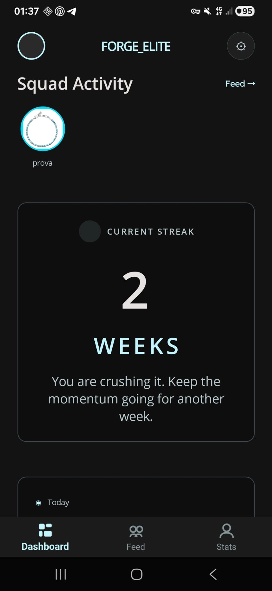
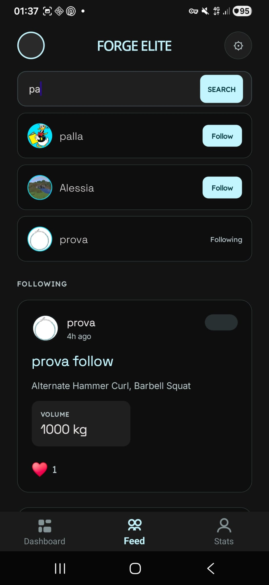
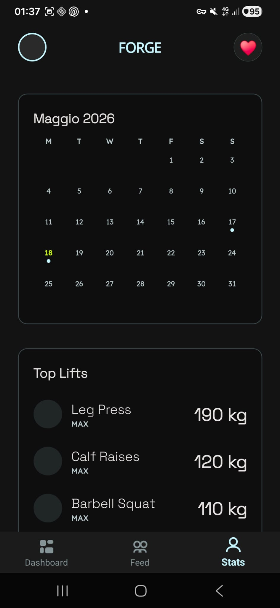
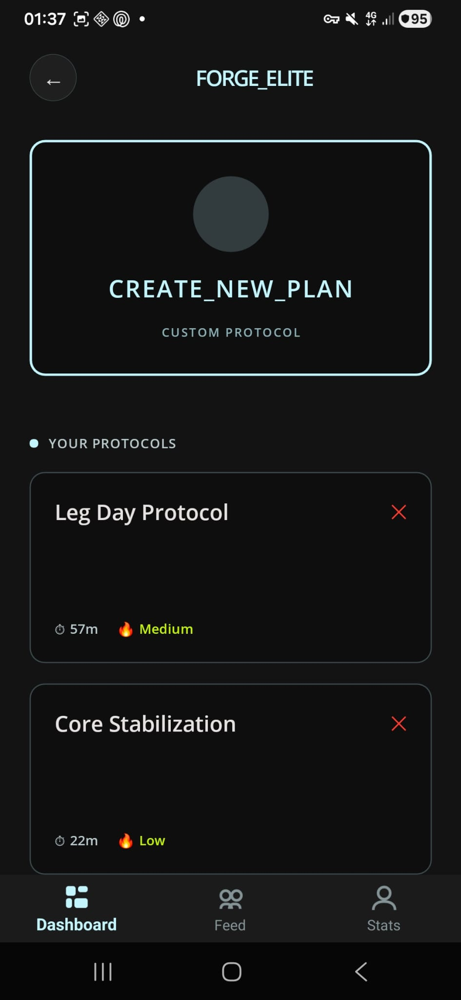
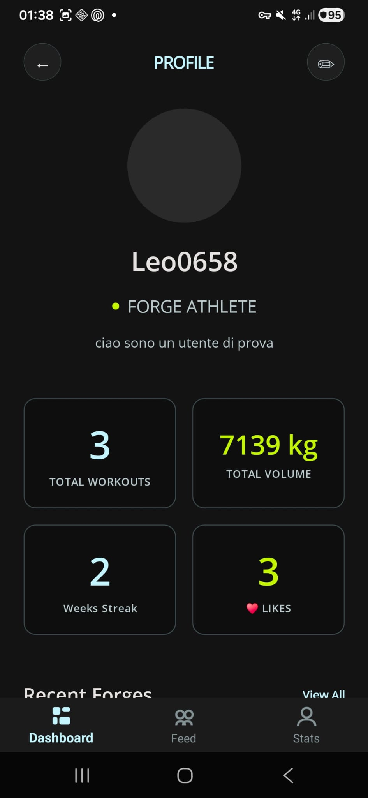
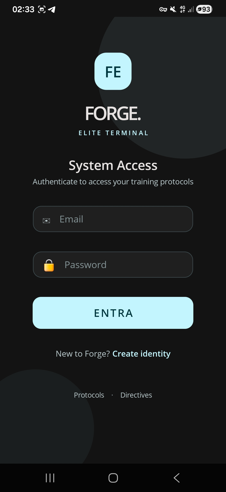

https://github.com/user-attachments/assets/28498cc5-b1e4-4de4-bce0-1627f3fb002d


<div align="center">

> 🌐 **[Visita il sito ufficiale](https://leonardo-lalli.github.io/FORGE/)** — multilingua, documentazione completa, download diretto

> ⚠️ **PROGETTO AMATORIALE A SCOPO DIDATTICO** ⚠️  
> Questa app è sviluppata da uno studente come progetto scolastico.  
> **Non è un prodotto commerciale.** Il server è self-hosted su hardware casalingo.  
> Potrebbero esserci bug, limitazioni e downtime non pianificati.  
> Usala per test e dimostrazioni, non per dati importanti.




[🇬🇧 English](README_en.md) · [🇮🇹 Italiano](README.md) · [🇪🇸 Español](README_es.md) · [🇨🇳 中文](README_zh.md)
# FORGE

### Il diario di allenamento sociale

[](https://learn.microsoft.com/dotnet/maui/)
[](https://pocketbase.io/)
[](https://duckdns.org)
[](https://oss.exercisedb.dev)
[](#self-hosting-docker)
[](https://learn.microsoft.com/dotnet/communitytoolkit/mvvm/)
[](tests/)
[](LICENSE)

[](https://github.com/Leonardo-Lalli/FORGE/stargazers)
[](https://github.com/Leonardo-Lalli/FORGE/releases)
[](https://github.com/Leonardo-Lalli/FORGE/commits)
[](https://github.com/Leonardo-Lalli/FORGE/releases/latest)

**Trasforma ogni ripetizione in progresso. Sfida i tuoi amici. Supera i tuoi limiti.**

### 🔗 Link Rapidi
[📦 Download APK](#download-apk) · [🐳 Self-Hosting Docker](#self-hosting-docker) · [📱 Screenshot](#screenshot) · [🛠️ Sviluppo](#sviluppo) · [✅ Stato Progetto](#stato-del-progetto) · [🔒 Sicurezza](#sicurezza)

---

🎬 **[Guarda il video demo](assets/Videos/hailuo-2_3_sculptural_clay_art_Create_a_premium_mobile_app_splash_screen_for_a_fitness_and_-0.mp4)**

</div>

---

## Cos'è FORGE

FORGE è un'app Android per il tracking degli allenamenti in palestra, con un'anima social. Registra esercizi, serie e ripetizioni. Segui i tuoi amici. Sblocca achievement. Guarda i tuoi progressi con statistiche dettagliate.

| Problema | Soluzione FORGE |
|----------|----------------|
| Non ricordi i pesi della volta scorsa | Storico allenamenti con dettaglio serie per serie |
| Non sai quali esercizi fare per un muscolo | Catalogo 1.500+ esercizi con GIF, ricerca e filtri |
| Ti alleni da solo e perdi motivazione | Feed amici, like, streak settimanali, achievement |

### Perché FORGE invece di Strong / Hevy / FitNotes?

| Feature | FORGE | Strong | Hevy | FitNotes |
|---------|:-----:|:------:|:----:|:--------:|
| Prezzo | **Gratis** | ~80€/anno | 40€/anno | Gratis (no social) |
| Open source | **✅** | ❌ | ❌ | ❌ |
| Self-hosting backend | **✅** | ❌ | ❌ | ❌ |
| 1.500+ esercizi con GIF | **✅** | ~1.000 | ~400 | ~100 |
| Feed sociale (like, follow) | **✅** | ❌ | ✅ | ❌ |
| Achievement / gamification | **48 badge** | ❌ | ❌ | ❌ |
| Foto progresso | **✅** | ❌ | ✅ | ❌ |
| Offline + sync | **✅** | ❌ | Premium | ✅ (locale) |
| CSV import/export | **✅** | Premium | Premium | ✅ |
| Privacy-first | **✅** | ❌ | ❌ | ✅ |

---

## Stato del Progetto

| Stato | Categoria | Dettaglio |
|:-----:|-----------|-----------|
| ✅ | 🏋️ Allenamento | Ricerca 1.500+ esercizi con GIF, serie kg×reps, checkmark, rest timer, minimize/draft |
| ✅ | 📊 Statistiche | Grafico volume, top lifts, calendario, filtri WEEK/MONTH/3M/YEAR/ALL |
| ✅ | 👥 Social | Feed amici, like ♥, follow/unfollow, ricerca utenti live, richieste amicizia |
| ✅ | 🏆 Achievement | 48 badge con tracking automatico, vetrina profilo |
| ✅ | 👤 Profilo | Avatar con upload, bio, storico allenamenti, badge sbloccati |
| ✅ | 🎨 Tema | Doppio tema chiaro/scuro, font Inter/Lexend/SpaceGrotesk |
| ✅ | 📱 Offline | SQLite locale + sync automatico quando torna la connessione |
| ✅ | 📁 CSV | Import/export allenamenti con validazione |
| ✅ | 🔒 Sicurezza | Certificate pinning, HTTPS, SecureStorage, API rules row-level, rate limiting, admin bloccato |
| 🟡 | 🖼️ Foto workout | Supportate (max 3MB, base64 nel record). Nessuna compressione server-side |
| 🟡 | 📡 Connessione | L'app richiede rete per login e ricerca nuovi esercizi. Cache locale per esercizi già visti |
| 🔴 | 🔔 Notifiche push | Non ancora implementate (Firebase SDK non supporta .NET 10). Le notifiche sono pull (apri l'app per vederle) |
| 🔴 | ⚖️ Body tracking | Peso corporeo e misure non ancora implementati |
| 🔴 | 🏅 Leaderboard | Classifica tra amici non implementata (sostituita da feed + like) |
| 🚧 | 🛡️ Cert pinning | Implementato lato client; da testare sul server reale |

---

## Screenshot

<div align="center">

| Dashboard | Feed | Stats |
|:---:|:---:|:---:|
|  |  |  |

| Active Workout | Profile | Achievements |
|:---:|:---:|:---:|
|  |  |  |

</div>

---

## Architettura

```
┌──────────────────────────────────────────────────┐
│                  .NET MAUI App                    │
│  ┌──────────┐  ┌───────────┐  ┌──────────┐      │
│  │  Views   │  │ ViewModels│  │ Services │      │
│  │  XAML    │◄─┤ MVVM      │◄─┤ Business │      │
│  │  puro    │  │ Toolkit   │  │ Logic    │      │
│  └──────────┘  └───────────┘  └────┬─────┘      │
│                                    │             │
│         ┌──────────────────────────┼──────┐      │
│    ┌────▼────┐   ┌──────────┐  ┌──▼───┐ │      │
│    │PocketBase│  │ExerciseDB│  │SQLite│ │      │
│    │ Auth +   │  │ v1 API   │  │Locale│ │      │
│    │ Social   │  │ 1.500+ex │  │Cache │ │      │
│    └─────────┘  └──────────┘  └──────┘ │      │
└─────────────────────────────────────────┘      │
```

### Stack

| Layer | Tecnologia |
|-------|-----------|
| Framework | .NET MAUI 10 (Android-first) |
| UI Pattern | MVVM con CommunityToolkit.Mvvm 8.4 |
| Navigation | Shell (3 tab + 8 route) |
| Backend | PocketBase self-hosted (auth, social, storage) |
| API | ExerciseDB v1 (1.500+ esercizi, gratuito) |
| Persistenza | SQLite (sqlite-net-pcl) |
| Test | xUnit (27 test) |
| Font | Inter, Lexend, Space Grotesk (Google Fonts) |

---

## Download APK

L'APK Release è disponibile nella sezione [Releases](https://github.com/USERNAME/FORGE/releases) di GitHub.

Per compilare l'APK da sorgente:
```bash
dotnet publish src/Forge/Forge.csproj -f net10.0-android -c Release /p:AndroidPackageFormats=apk
```

> Richiede Android 7.0+ e connessione Internet per le API.

---

## Self-Hosting (Docker)

FORGE è privacy-first: puoi far girare il backend **su un tuo server** (Raspberry Pi, NAS, Proxmox, vecchio PC). I tuoi dati restano dentro casa tua.

### Avvia il backend (one-liner per Linux)

```bash
bash <(curl -sSL https://raw.githubusercontent.com/Leonardo-Lalli/FORGE/main/tools/community-install.sh)
```

Lo script fa tutto da solo — clona, avvia, crea admin e collezioni. Stile Proxmox Community Scripts.

### Avvia il backend (passo passo, tutti gli OS)

```bash
# 1. Clona
git clone https://github.com/Leonardo-Lalli/FORGE.git && cd FORGE

# 2. Avvia PocketBase
docker compose up -d pocketbase

# 3. Crea il superuser (CLI — funziona su Linux, Mac e Windows PowerShell)
docker compose exec -T pocketbase /pocketbase superuser create admin@forge.local forgeadmin123

# 4. Crea le collezioni
docker compose up -d init && docker compose logs init

# 5. Mostra IP del server
docker compose logs show-ip
```

E questo è tutto. PocketBase è già configurato con:
- **Superuser** precreato (`admin@forge.local` / `forgeadmin123` — cambia subito la password!)
- **Collezioni** `logged_workouts`, `social_graph`, `excercise` con API rules row-level
- **Nessuna configurazione manuale** necessaria

### Configura l'app

1. Installa l'APK sul telefono
2. Apri FORGE → Impostazioni → **URL PocketBase**
3. Inserisci l'URL mostrato nel box (es. `http://192.168.1.50:8090`) 
4. Tocca **SALVA**

L'app userà il tuo server invece di quello predefinito. Funziona anche in LAN senza dominio pubblico — ti registri, ti alleni, e quando torni a casa sul Wi-Fi i workout si sincronizzano automaticamente.

### Admin panel (opzionale)

Apri `http://localhost:8090/_/` dal browser del server. Login con le credenziali auto-create (admin@forge.local / forgeadmin123). Cambia subito la password! Da qui puoi gestire utenti, collezioni e API rules.

---

## Sviluppo

### Prerequisiti
- .NET 10 SDK + MAUI workload
- Dispositivo Android o emulatore (Android 7+)
- Server PocketBase (`docker compose up` o configurabile via `.env`)

### Setup rapido

```bash
# 1. Clona
git clone https://github.com/USERNAME/FORGE.git
cd FORGE

# 2. Configura
cp .env.example .env
# Modifica .env con l'URL del tuo server PocketBase

# 3. Build
dotnet build src/Forge/Forge.csproj -f net10.0-android

# 4. Test
dotnet test tests/Forge.Tests/

# 5. Pubblica APK
dotnet publish src/Forge/Forge.csproj -f net10.0-android -c Release /p:AndroidPackageFormats=apk
```

### Struttura

```text
├── src/Forge/       # Progetto MAUI
│   ├── Models/                  # Entità dominio + DTO
│   ├── ViewModels/              # MVVM ViewModels (12)
│   ├── Views/                   # XAML Views (10)
│   ├── Services/                # Business logic (13)
│   ├── Converters/              # Value converters (1)
│   └── Resources/               # Stili, font, immagini
├── tests/Forge.Tests/  # Test xUnit (27)
├── docker-compose.yml           # Backend PocketBase self-hosted
├── tools/
│   ├── ExerciseImporter/        # Import esercizi su PocketBase
│   └── pb_hooks/                # Hook PocketBase (FCM)
└── docs/                        # Documentazione
```

### Branch

| Branch | Scopo |
|--------|-------|
| `main` | Versione stabile, pronta per la distribuzione |
| `develop` | Sviluppo attivo, nuove feature e fix |
| `feature/*` | Feature branch (da mergiare in develop) |

---

## Documentazione

| Documento | Contenuto |
|-----------|-----------|
| [`docs/spec.md`](docs/spec.md) | Specifica prodotto, epic, user stories, criteri accettazione |
| [`docs/plan.md`](docs/plan.md) | Piano iterazioni con stato |
| [`docs/architecture.md`](docs/architecture.md) | Architettura tecnica |
| [`docs/project-journal.md`](docs/project-journal.md) | Diario di sviluppo completo |
| [`docs/test-matrix.md`](docs/test-matrix.md) | Matrice 42 test manuali |
| [`docs/api-notes.md`](docs/api-notes.md) | Note tecniche API |

---

## Privacy

I dati sono salvati in due posti:
- **Sul tuo telefono**: database SQLite locale (workout, esercizi, achievement, piani)
- **Sul server FORGE**: autenticazione, workout completati, like, follower

Vedi [`PRIVACY.md`](PRIVACY.md) per i dettagli completi.

## Sicurezza

| Misura | Dettaglio |
|--------|-----------|
| Password | Cifrata con SecureStorage (Android Keystore) |
| Connessione | HTTPS con Let's Encrypt + certificate pinning |
| Database remoto | API rules row-level (ogni utente vede solo i propri dati) |
| Admin panel | Bloccato da accesso esterno (403) |
| Rate limiting | 5 tentativi login/minuto, 60 req/min API |
| Backup Android | Disabilitato (`allowBackup=false`) |

## Disclaimer

**FORGE è un progetto didattico** sviluppato come parte di un percorso di studi in informatica. Non è un prodotto commerciale. Il server è self-hosted su hardware casalingo e potrebbe non essere sempre disponibile. L'API ExerciseDB è un servizio gratuito di terze parti con limitazioni di utilizzo.

## Licenza

MIT License — vedi il file [LICENSE](LICENSE) per i dettagli.

---

## Attributions

- **ExerciseDB API**: Exercise data and GIFs provided by [ExerciseDB](https://github.com/yuhonas/free-exercise-db) (free, non-commercial use)
- **Badge icons**: created with Canva Pro
- **Fonts**: Inter, Lexend, Space Grotesk by Google Fonts (SIL Open Font License)

---

## Community & Support

<div align="center">

**Ti piace FORGE? Lascia una star!**

[](https://github.com/Leonardo-Lalli/FORGE/stargazers)

[⭐ Star](https://github.com/Leonardo-Lalli/FORGE/stargazers) · [🐛 Bug report](https://github.com/Leonardo-Lalli/FORGE/issues/new?template=bug_report.md) · [💡 Feature request](https://github.com/Leonardo-Lalli/FORGE/issues/new?template=feature_request.md) · [💬 Discussioni](https://github.com/Leonardo-Lalli/FORGE/discussions)

</div>

---

<div align="center">

**FORGE** — Costruisci il tuo fisico. Sfida i tuoi amici. Forgia la tua leggenda.

</div>
